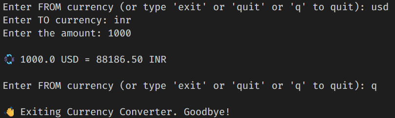
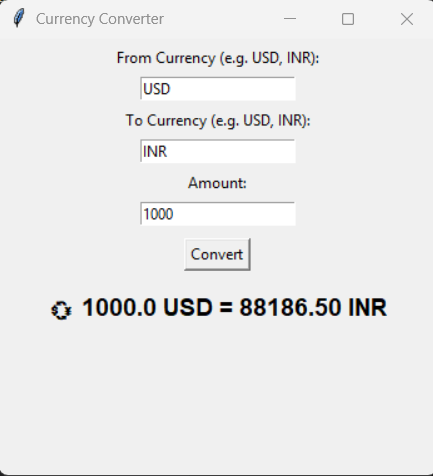

# Python Live Currency Converter

This repository contains two versions of a **Python Currency Converter** that fetches live exchange rates using the [exchangerate.host](https://exchangerate.host/) API. It is designed for both command-line (CLI) and graphical user interface (GUI) usage.

---

## Version 01 - CLI Currency Converter

### 📌 Overview
A command-line interface (CLI) Python script to convert currencies in real-time. Users can interact through terminal input and see instant conversion results.

### Features
- Real-time conversion between any two currencies.
- Handles invalid inputs gracefully.
- Lightweight and easy-to-use CLI interface.

### Requirements
- Python 3.x
- `requests` library

```bash
pip install requests
```

### How to Run
1. Clone the repository.
2. Run the script:

```bash
python currency_coverter_api.py
```

3. Follow prompts in the terminal:
   - Enter the **source currency** (e.g., USD)
   - Enter the **target currency** (e.g., INR)
   - Enter the **amount** to convert
   - Type `exit`, `quit`, or `q` to stop the program.

---

## Version 02 - GUI Currency Converter (Tkinter)

### 📌 Overview
A Python GUI application built with **Tkinter**. Users can input currencies and amount via a graphical interface and see the converted value instantly.

### Features
- Intuitive GUI for currency conversion.
- Validates user input.
- Displays conversion results in the app window.
- Uses live exchange rates from exchangerate.host API.


### Requirements
- Python 3.x
- `requests` library
- `tkinter` (usually comes pre-installed with Python)

```bash
pip install requests
```

### How to Run
1. Clone the repository.
2. Run the script:

```bash
python currency_coverter_GUI_gui.py
```

3. Use the GUI to:
   - Enter **From Currency** (e.g., USD)
   - Enter **To Currency** (e.g., INR)
   - Enter **Amount**
   - Click **Convert** to see the converted value.

---

## API Used
- [exchangerate.host](https://exchangerate.host/) - Free API for real-time currency conversion.

---

## Screenshots

**CLI Version:**  




**GUI Version:**  

 

---

## Author
**Imran Ahmad**  
Python Automation Tester | Selenium | PyTest | API Testing  

---

✅ Developed as part of a Python automation learning exercise.

